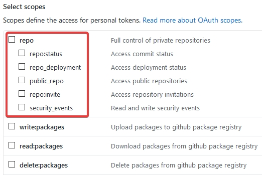

# Bulk Git Clone
This is a simple **PHP** Script which can clone all your github repo into local.

## Why ?
Well i have around 150+ repositories in personal account and 200+ in organization accounts

and i found it hard & ⌛ consuming to clone each of them manually. so i created a **PHP** script which can do it for me with the help of **Github API** 

## Usage

### Step 1
clone this into your local / download this repo 

### Step 2
Create a Personal Access Token with 👇 **Scopes**


### Step 3
Run **PHP** script using the 👇 CMD
```text
php cloneall.php {your-personal-github-token}
```

**With Custom Location To Save Your Repositories***
```text
php cloneall.php {your-personal-github-token} /home/your-location/path/
```

## Contribute
If you would like to help, please take a look at the list of
[issues][issues] or the [To Do](#-todo) checklist.

## License
This project is licensed under **General Public License v3.0 license**. See the [LICENSE](LICENSE) file for more info.

## Copyright
2017 - 2020 Varun Sridharan, [varunsridharan.in][website]

If you find it useful, let me know :wink:

You can contact me on [Twitter][twitter] or through my [email][email].

## Backed By
| [![DigitalOcean][do-image]][do-ref] | [![JetBrains][jb-image]][jb-ref] |  [![Tidio Chat][tidio-image]][tidio-ref] |
| --- | --- | --- |

[twitter]: https://twitter.com/varunsridharan2
[email]: mailto:varunsridharan23@gmail.com
[website]: https://varunsridharan.in
[issues]: issues/

[do-image]: https://vsp.ams3.cdn.digitaloceanspaces.com/cdn/DO_Logo_Horizontal_Blue-small.png
[jb-image]: https://vsp.ams3.cdn.digitaloceanspaces.com/cdn/phpstorm-small.png?v3
[tidio-image]: https://vsp.ams3.cdn.digitaloceanspaces.com/cdn/tidiochat-small.png
[do-ref]: https://s.svarun.in/Ef
[jb-ref]: https://www.jetbrains.com
[tidio-ref]: https://tidiochat.com